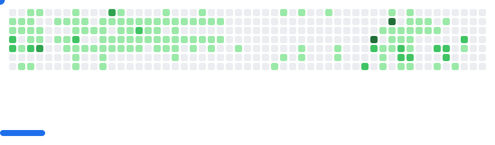

# Hi there, I’m Amit 👋

I’m a full-stack developer who loves building clean, intuitive, and scalable digital experiences.  
Most of my work lives in the JavaScript and Python ecosystems, but I also enjoy exploring other technologies when a project calls for it.

💻 **What I work on:**

- Full-stack web apps 
- Command-line tools, automation scripts, & software
- APIs, integrations, and data-driven projects
- Python & Localized LLMs
- Algorithmic Trading

✨ **What drives me:**  
    I enjoy solving problems, designing seamless user experiences, and bringing creative ideas to life. Whether it’s a social media platform for fishkeepers 🐠, a property management tool, algorithmic bots, or CLI apps that make developers’ lives easier, I like building projects that are practical and fun.

📂 **Check out my projects below**, and feel free to connect if you’d like to collaborate or chat tech!

<!-- GitHub Stats Images -->

<!--  -->

<!--   <h4>Connect</h4> -->
<!-- <a style="text-decoration:none" href="https://www.linkedin.com/in/amitsmangat/" target="_blank"> -->
<!--  -->
<!-- </a> -->

<!--   -->
<!-- </a> -->
<!--  -->
<!--  -->
<!--  -->

<picture>
  <source
    media="(prefers-color-scheme: dark)"
    srcset="images/breakout-dark.svg"
  />
  <source
    media="(prefers-color-scheme: light)"
    srcset="images/breakout-light.svg"
  />
  
</picture>

